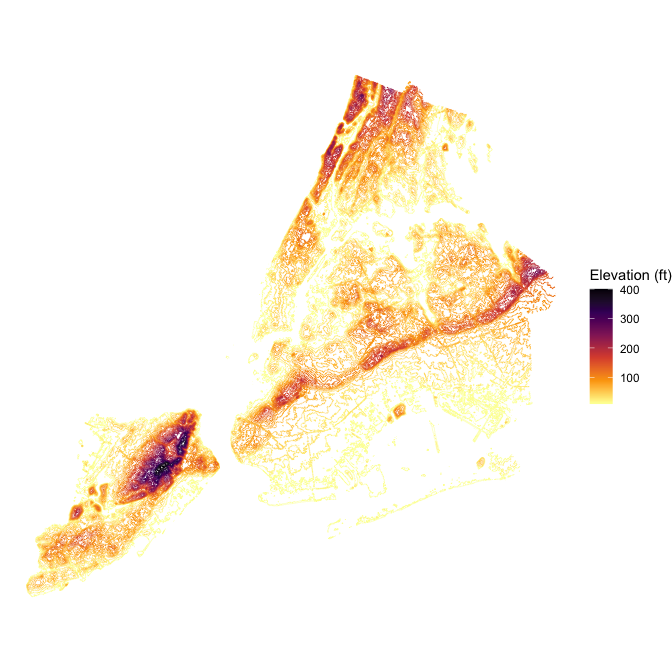
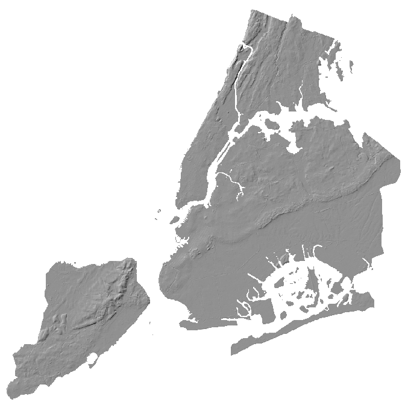

# nycterrain 

Bare-earth digital elevation model for New York City, derived from the
City’s 1-foot 2010 LiDAR data. The package ships mean-aggregated 50-foot
and 100-foot GeoTIFFs masked to the borough boundaries, plus a small
contour `sf` object for ggplot2 overlays.

## Installation

You can install nycterrain from GitHub:

``` r

remotes::install_github("kjhealy/nycterrain")
```

## Loading

``` r

library(nycterrain)
library(terra)
library(sf)
library(ggplot2)
```

## What’s included

The 100-foot and 50-foot rasters are accessed through functions that
return a
[`terra::SpatRaster`](https://rspatial.github.io/terra/reference/SpatRaster-class.html):

``` r

nyc_terrain_100ft()
#> class       : SpatRaster 
#> size        : 1561, 1581, 1  (nrow, ncol, nlyr)
#> resolution  : 100, 100  (x, y)
#> extent      : 910719.3, 1068819, 119060.7, 275160.7  (xmin, xmax, ymin, ymax)
#> coord. ref. : NAD83 / New York Long Island (ftUS) (EPSG:2263) 
#> source      : nyc_terrain_100ft.tif 
#> name        :     elev 
#> min value   :   0.0000 
#> max value   : 406.0309
```

Use
[`nyc_terrain_path()`](https://kjhealy.github.io/nycterrain/reference/nyc_terrain_path.md)
to get the GeoTIFF path directly, e.g. for use with `stars`, GDAL, or
`rayshader`:

``` r

nyc_terrain_path("50ft")
#> [1] "/Users/kjhealy/Library/R/library/nycterrain/extdata/nyc_terrain_50ft.tif"
```

The contour-line dataset is lazy-loaded:

``` r

nyc_terrain_contours_sf
#> Simple feature collection with 40 features and 1 field
#> Geometry type: GEOMETRY
#> Dimension:     XY
#> Bounding box:  xmin: 913226 ymin: 120685.4 xmax: 1067369 ymax: 272810.7
#> Projected CRS: NAD83 / New York Long Island (ftUS)
#> # A tibble: 40 × 2
#>    elev_ft                                                              geometry
#>      <dbl>                                    <MULTILINESTRING [US_survey_foot]>
#>  1      10 ((924658.6 123899.9, 924569.3 123844.9, 924492.1 123810.7, 924469.3 …
#>  2      20 ((913369.3 123441.1, 913352.8 123510.7, 913350.3 123610.7, 913351.6 …
#>  3      30 ((913369.3 123841.7, 913359.5 123910.7, 913369.3 124002, 913370.3 12…
#>  4      40 ((913469.3 123404.8, 913467.8 123410.7, 913436.1 123510.7, 913428 12…
#>  5      50 ((913469.3 123552.2, 913462.7 123610.7, 913461.5 123710.7, 913442.2 …
#>  6      60 ((913569.3 123454.3, 913548.8 123510.7, 913536.6 123610.7, 913522.1 …
#>  7      70 ((913669.3 123685.6, 913645.9 123710.7, 913669.3 123755.1, 913702.4 …
#>  8      80 ((916869.3 124296.1, 916859.7 124310.7, 916869.3 124377.5, 916969.3 …
#>  9      90 ((917569.3 126535.7, 917543.8 126610.7, 917569.3 126637, 917669.3 12…
#> 10     100 ((918369.3 132378.1, 918308 132410.7, 918369.3 132469.8, 918469.3 13…
#> # ℹ 30 more rows
```

## Examples

### A simple terrain map

``` r

ggplot(nyc_terrain_contours_sf) +
  geom_sf(aes(color = elev_ft), linewidth = 0.15) +
  scale_color_viridis_c(option = "G", direction = -1) +
  labs(color = "Elevation (ft)") +
  theme_void()
```



### Hillshade with terra

``` r

r <- nyc_terrain_100ft()
slp <- terrain(r, "slope", unit = "radians")
asp <- terrain(r, "aspect", unit = "radians")
hs <- shade(slp, asp, angle = 35, direction = 315)
plot(hs, col = grey(0:100 / 100), legend = FALSE, axes = FALSE, mar = c(0, 0, 0, 0))
```



## Functions and data

- [`nyc_terrain_100ft()`](https://kjhealy.github.io/nycterrain/reference/nyc_terrain_100ft.md)
  – 100ft mean-aggregated `SpatRaster`
- [`nyc_terrain_50ft()`](https://kjhealy.github.io/nycterrain/reference/nyc_terrain_100ft.md)
  – 50ft mean-aggregated `SpatRaster`
- [`nyc_terrain_path()`](https://kjhealy.github.io/nycterrain/reference/nyc_terrain_path.md)
  – path to a bundled GeoTIFF
- `nyc_terrain_contours_sf` – contour lines for ggplot2 overlays

## Source

City of New York, 1-foot Digital Elevation Model (DEM):
<https://data.cityofnewyork.us/City-Government/1-foot-Digital-Elevation-Model-DEM-/dpc8-z3jc>.
Bare-earth, hydro-flattened raster derived from 2010 LiDAR. Vertical
datum NAVD88, units in feet. CRS EPSG:2263 (NAD83 / New York Long
Island, ftUS).
